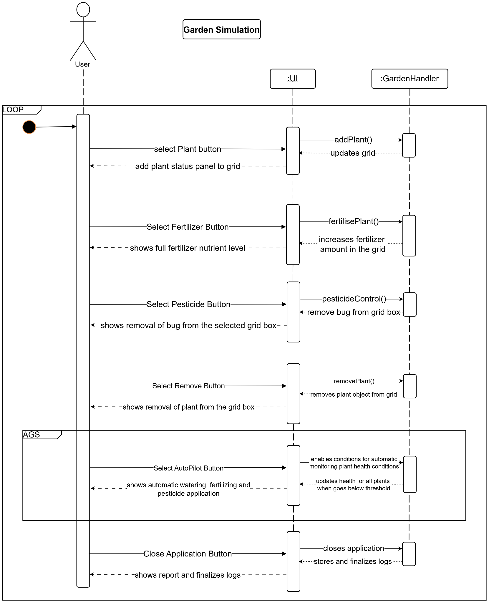
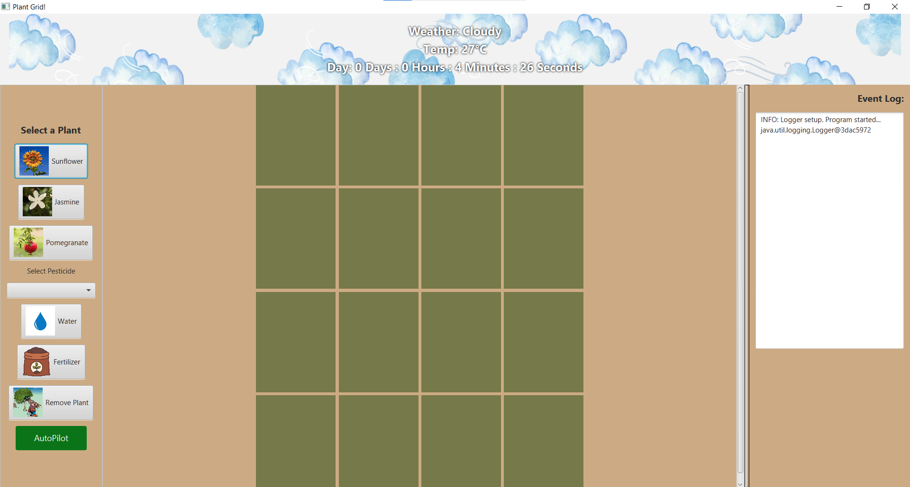
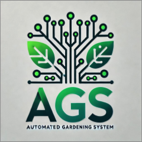

# Automatic-Gardening-System

This project aims to develop an Automated Gardening System using Java that caters to various users, including garden owners, gardeners and more. So this is a JavaFX project which simulates a gardening system. 

### Objectives
1. Automate Gardening Tasks
2. Soil Moisture and Nutrient Monitoring
3. Pest Monitoring and Control
4. Execute Gardening Tasks Manually
5. Real-Time Monitoring
6. User-Friendly Interface
7. Logging

Here are the requirements of the simulation:
1. Performance Requirements

    ● The system should respond to user interactions within 100 milliseconds.

    ● Background updates (such as AutoPilot mode) should occur without noticeable delays.

2. Usability Requirements

    ● The UI should be intuitive and easy to navigate.

    ● Buttons and controls should be clearly labeled and logically placed.

3. Reliability & Fault Tolerance

    ● The system should be able to run continuously for 24+ hours without crashing.

4. Scalability & Extensibility

    ● The grid should be expandable to accommodate more plant slots if needed.

Here's the sequence diagram of the simulation:

The key components of the implementation include:
1. User Interface (JavaFX-based GUI)
2. Core Functionalities and Logic
    i.  Plant Management
    ii. Autopilot Mode
    iii.Weather Simulation
    iv. Pesticide Application
    v.  Logging System
    vi. Schedulers and Timers
3. Backend and Data Handling (Multi-threaded Program)
4. Robust Exception Handling

Here's the UI:

  

